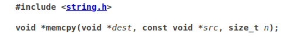

# Bonus1

## Analysis

You can find the decompiled program [here](./bonus1_decomp.c).

The programs takes two arguments, the first argument is stored inside an int `v1` after being passed to `atoi()`:

```c
v1 = atoi(a1->field_4);
```

While the second argument is assigned to `v0` inside the `memcpy()` a bit later:

```c
memcpy(&v0, a1->field_8, v1 * 4);
```

A first check is done, if `v1` is more than 9 then the program stops. Else it will copy the second argument in the buffer of size 40 using `memcpy()`.

However, `memcpy()` will only copy `v1 * 4` bytes into our buffer, which will yield a maximum of 36 bytes if we respect the 9 int limit (`9 * 4 = 36`), which is not enough to overflow.

## Explanations

We will need to pass the first check so `v1` needs to be < 9.

After that, we will need to allow `memcpy()` to copy more than 40 bytes into the buffer, let's simply call it `buf[40]`. This would allow us to replace the content of `v1` after the check!

The important part being that our first argument is passed as a int, but is interpreted later as an unsigned int by `memcpy()`.

## First check - `if (v1 > 9)`

Since the first argument is stored inside of an int, it means we can pass negative values, so the first check will not be triggered.

Why would that be useful ? Because it will be treated as a positive value anyway inside of `memcpy()` since it uses a `size_t`:



This will allow us to bypass the 36 size limit we talked about earlier.

## Second check - `if (v1 != 0x574f4c46)`

Now we need a way to modify the value we passed as our first argument and which we used to pass the first check earlier.

Good news is that we can use `v0` and `v1` placement in memory, since one follows the other.

The overflow we can perform in `memcpy()` would allow us to modify the value of `v1` since it's located right after our buffer.

## The exploit

<details>
  <summary>Spoiler</summary>

First, we need to find a value which allows us to pass the first check while overflowing on `v1` during the `memcpy()`.

Since `v0` has a size of 40, `v1 * 4` needs to be equal to 40 + size of what we want to write inside `v1(sizeof(int) = 4)` => 44.

To find this value, we used [this tool](./test.c) which allowed us to find a value that corresponds to our criteria.

This gave us `-2147483637`, which converted as an unsigned int equals 44.

The only thing left to do is to pass 40 filler characters and the value we want to pass the second check as the second argument, being `0x574f4c46`.

### The payload

```bash
bonus1@RainFall:~$ ./bonus1 -2147483637 $(python -c 'print "A" * 40 + "\x46\x4c\x4f\x57"')
$ whoami
bonus2
$ cat /home/user/bonus2/.pass
579bd19263eb8655e4cf7b742d75edf8c38226925d78db8163506f5191825245
$ 
```

</details>